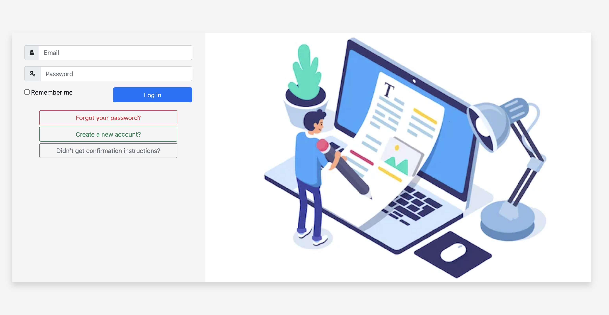

# Rails Blog App



## Project Description

The Blog app is a classic example of a blog website. I created a fully functional website that will show the list of posts and empower readers to interact with them by adding comments and liking posts.


## Built With

- Ruby
- Ruby on Rails
- Rubocop

# Get Started
Follow these steps below:

## Pre-requisites

```bash
- Ruby
- Rails
- PostgreSQL
```

## Setup
Clone the repo and run bundle install in the command line to install the dependencies

```bash
$ git clone https://github.com/clintonjosephs/blog-app.git
$ cd blog-app
```

## Install gems with:

```bash
$ bundle install
```

## Install style linters with
```bash
$ npm install
```

## Start rails server (puma)

```bash
$ rails server
```

Open [http://localhost:3000/](http://localhost:3000/) in your browser

## Author

👤 **Clinton Mbonu**

- GitHub: [@clintonjosephs](https://github.com/clintonjosephs)
- LinkedIn: [LinkedIn](https://linkedin.com/in/clinton-mbonu)
- Twitter: [@clintonmbonu2](https://twitter.com/clintonmbonu2)

## 🤝 Contributing

Contributions, issues, and feature requests are welcome!

Feel free to check the [issues page](../../issues/).

## Show your support

Give a ⭐️ if you like this project!

## Acknowledgments

- Hat tip to anyone whose code was used
- Inspiration
- etc

## 📝 License

See [PUBLIC](./LICENSE) license.